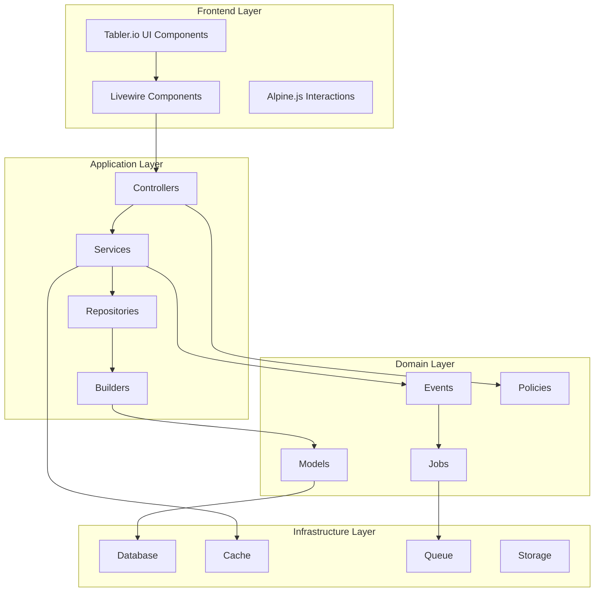
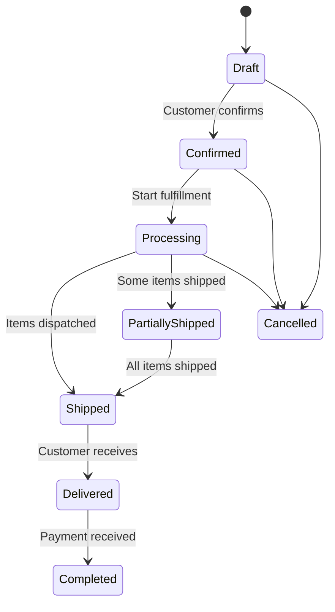
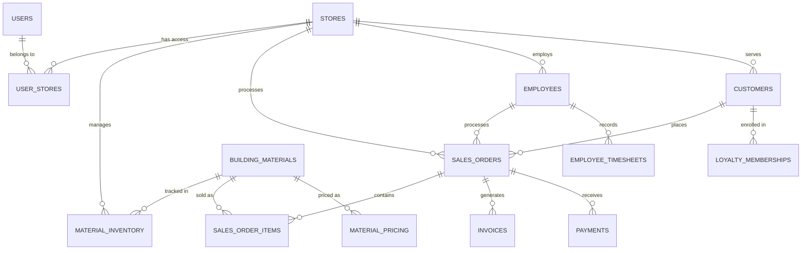

# Design Document

## Overview

BoxPos is designed as a multi-store construction material management system using Laravel framework with Livewire for dynamic frontend interactions and Tabler.io for consistent UI components. The system follows a package-based architecture with strict separation of concerns, implementing Repository + Builder patterns, comprehensive logging, and multi-tenant data isolation.

The design emphasizes maintainability, scalability, and security while providing an intuitive user experience across desktop and mobile devices. The system supports real-time updates, comprehensive reporting, and integration capabilities for external services.

## Architecture

### High-Level Architecture



### Package Structure

The system is organized into self-contained packages following the established structure:

```
packages/
├── Common/                 # Shared utilities and base classes
├── User/                  # User management and authentication
├── Store/                 # Store management and multi-tenancy
├── MaterialCatalog/       # Material catalog management
├── MaterialInventory/     # Inventory tracking and management
├── MaterialPricing/       # Pricing and cost management
├── MaterialSuppliers/     # Supplier relationship management
├── MaterialPurchasing/    # Purchase order management
├── Products/              # Product catalog (non-materials)
├── SalesOrders/          # Sales order processing
├── Customer/             # Customer relationship management
├── Employees/            # Employee management and HR
├── CashManagement/       # Financial transactions
├── Payments/             # Payment processing
├── Reports/              # Reporting and analytics
├── Notifications/        # Notification system
└── Loyalty/              # Customer loyalty programs
```

### Multi-Store Architecture

The system implements store isolation through:

1. **Store Context Middleware**: Automatically injects store_id into queries
2. **User-Store Relationships**: Many-to-many relationship with current store tracking
3. **Data Isolation**: All business entities scoped by store_id
4. **Permission System**: Role-based access with store-level permissions

## Components and Interfaces

### 1. Core System Components

#### Authentication & Authorization System

**Components:**
- `UserController`: Handle authentication flows
- `UserService`: Business logic for user management
- `UserRepository`: Data access for users
- `StoreMiddleware`: Store context management
- `PermissionPolicy`: Authorization rules

**Key Interfaces:**
```php
interface UserRepositoryInterface
{
    public function findByCredentials(array $credentials): ?User;
    public function getUserStores(User $user): Collection;
    public function setCurrentStore(User $user, int $storeId): bool;
}

interface StoreContextInterface
{
    public function getCurrentStore(): ?Store;
    public function switchStore(int $storeId): bool;
    public function hasStoreAccess(int $storeId): bool;
}
```

#### Header and Navigation System

**Livewire Components:**
- `HeaderComponent`: Main header with logo, notifications, user menu
- `NavigationComponent`: Dynamic menu system based on permissions
- `StoreSelector`: Store switching functionality
- `NotificationCenter`: Real-time notifications
- `ThemeSelector`: UI theme management

**Features:**
- Responsive design with mobile hamburger menu
- Dynamic menu loading based on user permissions
- Real-time notification updates
- Store context switching
- Theme customization (8 color themes)

### 2. Material Management Module

#### Material Catalog System

**Livewire Components:**
- `MaterialList`: Grid view with search, filter, pagination
- `MaterialForm`: Create/edit material information
- `MaterialSpecifications`: Technical specifications management
- `CategoryManagement`: Material category hierarchy
- `UnitManagement`: Unit of measure management

**Key Services:**
```php
class MaterialService
{
    public function createMaterial(array $data): BuildingMaterial;
    public function updateMaterial(BuildingMaterial $material, array $data): BuildingMaterial;
    public function searchMaterials(array $criteria): LengthAwarePaginator;
    public function getMaterialsByCategory(int $categoryId): Collection;
}
```

#### Inventory Management System

**Livewire Components:**
- `InventoryDashboard`: Overview of stock levels and alerts
- `StockTakeComponent`: Physical inventory counting
- `InventoryMovements`: Track all inventory transactions
- `DisposalManagement`: Handle damaged/expired materials
- `StockAlerts`: Low stock and reorder notifications

**Repository Pattern:**
```php
class MaterialInventoryRepository
{
    public function getCurrentStock(int $materialId, int $storeId): ?MaterialInventory;
    public function getMovementHistory(int $materialId, array $filters): Collection;
    public function updateStock(int $materialId, int $storeId, int $quantity, string $type): void;
    public function getLowStockItems(int $storeId): Collection;
}
```

### 3. Sales Management Module

#### Sales Order Processing

**Livewire Components:**
- `SalesOrderForm`: Create and edit sales orders
- `OrderItemsGrid`: Manage order line items
- `CustomerSelector`: Quick customer selection with search
- `PaymentProcessor`: Handle multiple payment methods
- `InvoiceGenerator`: Generate and print invoices
- `OrderTracking`: Track order status and fulfillment

**Workflow Design:**


#### Customer Management

**Livewire Components:**
- `CustomerList`: Searchable customer grid
- `CustomerProfile`: Comprehensive customer information
- `CustomerForm`: Create/edit customer details
- `PurchaseHistory`: Customer transaction history
- `LoyaltyManagement`: Points and rewards tracking
- `CustomerCommunication`: Contact history and preferences

### 4. Employee Management Module

#### Employee Information System

**Livewire Components:**
- `EmployeeList`: Employee directory with filters
- `EmployeeWizard`: Multi-step employee setup (4 steps as per requirements)
- `TimesheetManagement`: Attendance tracking
- `ScheduleManagement`: Work schedule planning
- `CommissionCalculator`: Sales commission tracking
- `PayrollProcessor`: Salary and wage calculations

**Multi-Step Employee Setup:**
1. **Step 1**: Personal information and employment details
2. **Step 2**: Organizational structure and work schedule
3. **Step 3**: System access and permissions
4. **Step 4**: Salary and benefits configuration

### 5. Financial Management Module

#### Cash Management System

**Livewire Components:**
- `CashDashboard`: Overview of all cash accounts
- `TransactionEntry`: Record income and expenses
- `TransactionHistory`: Searchable transaction log
- `AccountReconciliation`: Bank statement matching
- `CashFlowReports`: Financial performance analysis

**Service Layer:**
```php
class CashManagementService
{
    public function recordTransaction(array $transactionData): CashTransaction;
    public function reconcileAccount(int $accountId, array $bankData): ReconciliationResult;
    public function generateCashFlowReport(array $filters): CashFlowReport;
    public function getAccountBalance(int $accountId): float;
}
```

### 6. Reporting and Analytics Module

#### Report Generation System

**Livewire Components:**
- `ReportDashboard`: Main reporting interface
- `SalesReportGenerator`: Sales performance reports
- `InventoryReportGenerator`: Stock and movement reports
- `CustomerAnalytics`: Customer behavior analysis
- `EmployeePerformance`: Staff productivity reports
- `FinancialReports`: P&L, cash flow, balance sheet

**Report Types:**
- **Sales Reports**: Revenue, orders, product performance
- **Inventory Reports**: Stock levels, movements, ABC analysis
- **Customer Reports**: Acquisition, retention, lifetime value
- **Employee Reports**: Performance, attendance, commission
- **Financial Reports**: Profit/loss, cash flow, ratios

## Data Models

### Core Entity Relationships



### Store Isolation Implementation

All business entities include store context:

```php
// Base Model with Store Scope
abstract class StoreAwareModel extends Model
{
    protected static function booted()
    {
        static::addGlobalScope('store', function (Builder $builder) {
            if (auth()->check() && auth()->user()->current_store_id) {
                $builder->where('store_id', auth()->user()->current_store_id);
            }
        });
    }
}

// Repository Base Class
abstract class BaseRepository
{
    protected function applyStoreScope(Builder $query): Builder
    {
        return $query->where('store_id', $this->getCurrentStoreId());
    }
}
```

### Audit Trail Implementation

```php
trait Auditable
{
    protected static function bootAuditable()
    {
        static::creating(function ($model) {
            $model->created_by = auth()->id();
            $model->store_id = auth()->user()->current_store_id;
        });
        
        static::updating(function ($model) {
            $model->updated_by = auth()->id();
        });
    }
}
```

## Error Handling

### Exception Hierarchy

```php
// Base Application Exception
abstract class BoxPosException extends Exception
{
    abstract public function getErrorCode(): string;
    abstract public function getContext(): array;
}

// Domain-Specific Exceptions
class MaterialNotFoundException extends BoxPosException;
class InsufficientStockException extends BoxPosException;
class InvalidStoreAccessException extends BoxPosException;
class PaymentProcessingException extends BoxPosException;
```

### Error Response Strategy

1. **User-Friendly Messages**: Convert technical errors to user-friendly messages
2. **Contextual Information**: Provide relevant context for error resolution
3. **Logging Integration**: All errors logged with proper context using Loggable trait
4. **Graceful Degradation**: System continues operating when non-critical components fail

### Validation Strategy

```php
// Form Request Validation
class CreateSalesOrderRequest extends FormRequest
{
    public function rules(): array
    {
        return [
            'customer_id' => 'required|exists:customers,id',
            'items' => 'required|array|min:1',
            'items.*.material_id' => 'required|exists:building_materials,id',
            'items.*.quantity' => 'required|numeric|min:0.01',
        ];
    }
    
    public function withValidator($validator)
    {
        $validator->after(function ($validator) {
            $this->validateStockAvailability($validator);
        });
    }
}
```

## Testing Strategy

### Testing Pyramid

1. **Unit Tests**: Test individual classes in isolation
   - Service layer business logic
   - Repository data access methods
   - Model relationships and scopes
   - Utility classes and helpers

2. **Integration Tests**: Test component interactions
   - Service-Repository integration
   - Database constraint validation
   - Event-Listener workflows
   - API endpoint functionality

3. **Feature Tests**: Test complete user workflows
   - Sales order creation process
   - Employee setup wizard
   - Report generation
   - Multi-store data isolation

### Test Categories

#### Multi-Store Testing
```php
class MultiStoreTest extends TestCase
{
    public function test_user_can_only_access_authorized_stores()
    {
        // Test store isolation
    }
    
    public function test_data_is_filtered_by_current_store()
    {
        // Test automatic store filtering
    }
}
```

#### Livewire Component Testing
```php
class MaterialListTest extends TestCase
{
    public function test_can_search_materials()
    {
        Livewire::test(MaterialList::class)
            ->set('search', 'cement')
            ->assertSee('Portland Cement');
    }
}
```

#### Repository Pattern Testing
```php
class MaterialRepositoryTest extends TestCase
{
    public function test_search_applies_criteria_correctly()
    {
        $criteria = ['category' => 'cement', 'in_stock' => true];
        $results = $this->repository->search($criteria);
        
        $this->assertInstanceOf(Collection::class, $results);
    }
}
```

### Performance Testing

1. **Database Query Optimization**: Test N+1 queries, index usage
2. **Livewire Component Performance**: Test component rendering times
3. **Large Dataset Handling**: Test pagination and filtering performance
4. **Concurrent User Testing**: Test multi-user scenarios

### Security Testing

1. **Store Isolation**: Verify users cannot access other stores' data
2. **Permission Testing**: Verify role-based access controls
3. **Input Validation**: Test against injection attacks
4. **Authentication**: Test session management and security

## Implementation Guidelines

### Coding Standards Compliance

All code must follow the established coding rules:

1. **Mandatory Logging**: All Controllers and Services must use `Loggable` trait
2. **Repository + Builder Pattern**: Use established architecture patterns
3. **Laravel Sail**: All development must use Sail commands
4. **Type Hints**: Strict type hints for all parameters and return types
5. **PHPDoc**: Comprehensive documentation for all public methods

### Livewire Component Structure

```php
class MaterialList extends Component
{
    use WithPagination;
    
    public string $search = '';
    public array $filters = [];
    public int $perPage = 15;
    
    protected $queryString = [
        'search' => ['except' => ''],
        'filters' => ['except' => []],
    ];
    
    public function getMaterialsProperty()
    {
        return BuildingMaterial::query()
            ->when($this->search, fn($q) => $q->search($this->search))
            ->applyCriteria($this->filters)
            ->orderByName()
            ->paginate($this->perPage);
    }
    
    public function render()
    {
        return view('material-catalog::livewire.material-list');
    }
}
```

### Service Layer Implementation

```php
class MaterialService
{
    use Loggable; // MANDATORY
    
    protected MaterialRepository $materialRepository;
    
    public function createMaterial(array $data): BuildingMaterial
    {
        $this->logActivity('material_creation_started', [
            'user_id' => auth()->id(),
            'store_id' => auth()->user()->current_store_id,
        ]);
        
        DB::beginTransaction();
        
        try {
            $material = $this->materialRepository->create($data);
            
            event(new MaterialCreated($material));
            
            DB::commit();
            
            $this->logActivity('material_created', [
                'material_id' => $material->id,
                'user_id' => auth()->id(),
            ]);
            
            return $material;
        } catch (\Exception $e) {
            DB::rollback();
            
            $this->logError($e, [
                'action' => 'material_creation',
                'data' => $data,
            ]);
            
            throw $e;
        }
    }
}
```

This design provides a solid foundation for implementing the BoxPos system while maintaining consistency with the established coding standards and architectural patterns.