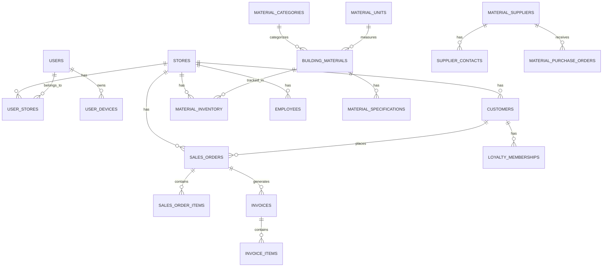

# Database Schema Design Document

## Overview

Hệ thống BoxPos sử dụng MySQL/PostgreSQL database với Laravel framework. Database được thiết kế để hỗ trợ multi-store architecture, cho phép một instance của ứng dụng quản lý nhiều cửa hàng vật liệu xây dựng khác nhau. Thiết kế tập trung vào việc tách biệt dữ liệu giữa các store thông qua store_id và đảm bảo tính toàn vẹn dữ liệu.

## Architecture

### Multi-Store Architecture
- **Store Isolation**: Mỗi record (trừ system tables) có store_id để phân biệt dữ liệu
- **User-Store Relationship**: Users có thể thuộc về nhiều stores thông qua bảng user_stores
- **Current Store Context**: Users có current_store_id để xác định store đang làm việc

### Data Flow Pattern
```
User Login → Select Store → Access Store-specific Data → Perform Operations
```

## Components and Interfaces

### 1. Core System Tables

#### Users & Authentication
- **users**: Thông tin user cơ bản, authentication
- **user_stores**: Many-to-many relationship giữa users và stores  
- **user_devices**: Track devices của users để security
- **cache**: Laravel cache system
- **jobs**: Laravel queue jobs

#### Store Management
- **stores**: Thông tin các cửa hàng
- **customers**: Khách hàng của từng store

### 2. Material Management Module

#### Material Catalog
- **material_categories**: Phân loại vật liệu (xi măng, sắt, gạch...)
- **material_units**: Đơn vị tính (kg, m3, cái...)
- **building_materials**: Catalog vật liệu xây dựng
- **material_specifications**: Thông số kỹ thuật chi tiết

#### Supplier Management  
- **material_suppliers**: Nhà cung cấp vật liệu
- **supplier_contacts**: Thông tin liên hệ nhà cung cấp

#### Inventory & Pricing
- **material_inventory**: Tồn kho vật liệu theo store
- **material_pricing**: Giá vật liệu theo thời gian
- **inventory_movements**: Lịch sử xuất nhập kho
- **stock_takes**: Kiểm kê kho
- **stock_take_items**: Chi tiết kiểm kê
- **inventory_disposals**: Thanh lý hàng hóa
- **inventory_disposal_items**: Chi tiết thanh lý

### 3. Purchasing Module
- **material_purchase_orders**: Đơn đặt hàng từ supplier
- **material_purchase_order_items**: Chi tiết đơn đặt hàng

### 4. Sales Management Module

#### Order Processing
- **sales_orders**: Đơn hàng bán ra
- **sales_order_items**: Chi tiết đơn hàng
- **invoices**: Hóa đơn
- **invoice_items**: Chi tiết hóa đơn
- **sales_returns**: Đơn trả hàng
- **sales_return_items**: Chi tiết trả hàng

#### Product & Service Management
- **product_categories**: Phân loại sản phẩm/dịch vụ
- **products**: Sản phẩm (có thể khác với building_materials)
- **product_variants**: Biến thể sản phẩm
- **services**: Dịch vụ (lắp đặt, vận chuyển...)

### 5. Employee Management Module
- **departments**: Phòng ban
- **positions**: Chức vụ
- **employees**: Nhân viên
- **employee_timesheets**: Chấm công
- **employee_schedules**: Lịch làm việc
- **employee_commissions**: Hoa hồng
- **employee_payroll**: Bảng lương

### 6. Financial Management Module

#### Cash Management
- **cash_categories**: Phân loại thu chi
- **cash_accounts**: Tài khoản tiền mặt/ngân hàng
- **cash_transactions**: Giao dịch thu chi

#### Payment Processing
- **payment_methods**: Phương thức thanh toán
- **payments**: Thanh toán

### 7. Marketing & Loyalty Module
- **promotions**: Chương trình khuyến mãi
- **promotion_usages**: Lịch sử sử dụng khuyến mãi
- **loyalty_programs**: Chương trình khách hàng thân thiết
- **loyalty_memberships**: Thành viên loyalty
- **loyalty_transactions**: Giao dịch tích điểm

### 8. Reporting & Analytics Module
- **report_templates**: Mẫu báo cáo
- **report_instances**: Báo cáo đã tạo
- **report_schedules**: Lịch tự động tạo báo cáo
- **report_dashboards**: Dashboard configuration

### 9. Notification System
- **notification_templates**: Mẫu thông báo
- **notifications**: Thông báo gửi đến users

## Data Models

### Key Relationships



### Store Isolation Pattern
Tất cả business tables có `store_id` foreign key:
- Đảm bảo data isolation giữa các stores
- Queries luôn filter theo current store
- Middleware tự động inject store_id

### Audit Trail Pattern
Các bảng quan trọng có:
- `created_at`, `updated_at`: Timestamp tracking
- `created_by`, `updated_by`: User tracking (optional)
- Soft deletes với `deleted_at`

## Error Handling

### Data Integrity
- Foreign key constraints đảm bảo referential integrity
- Unique constraints trên business keys
- Check constraints cho business rules
- Database-level validations

### Store Isolation Errors
- Middleware kiểm tra store access permissions
- Queries tự động filter theo store_id
- Error handling khi user access wrong store data

### Concurrency Control
- Optimistic locking với version fields
- Database transactions cho complex operations
- Queue jobs cho heavy operations

## Testing Strategy

### Database Testing
- Migration tests đảm bảo schema consistency
- Seeder tests cho sample data
- Foreign key constraint tests
- Performance tests cho large datasets

### Multi-Store Testing
- Store isolation tests
- User-store permission tests  
- Cross-store data leakage tests
- Store switching functionality tests

### Data Integrity Testing
- Constraint violation tests
- Cascade delete tests
- Business rule validation tests
- Audit trail functionality tests

### Performance Testing
- Query performance với large datasets
- Index effectiveness tests
- Connection pooling tests
- Cache layer integration tests