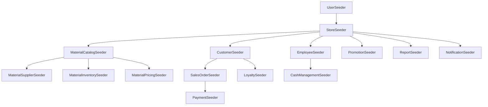

# Database Seeders Design Document

## Overview

Hệ thống seeders cho BoxPos được thiết kế theo package-based architecture, mỗi package sẽ có seeders riêng để tạo dữ liệu mẫu. Thiết kế tập trung vào việc hỗ trợ multi-store architecture, đảm bảo store isolation, và tuân theo coding rules của project. Seeders sẽ sử dụng Factory pattern kết hợp với manual seeding cho dữ liệu chuẩn.

## Architecture

### Package-Based Seeder Structure
```
packages/
├── store/src/Database/Seeders/StoreSeeder.php
├── user/src/Database/Seeders/UserSeeder.php
├── customer/src/Database/Seeders/CustomerSeeder.php
├── material-catalog/src/Database/Seeders/MaterialCatalogSeeder.php
├── material-suppliers/src/Database/Seeders/MaterialSupplierSeeder.php
├── material-inventory/src/Database/Seeders/MaterialInventorySeeder.php
├── material-pricing/src/Database/Seeders/MaterialPricingSeeder.php
├── sales-orders/src/Database/Seeders/SalesOrderSeeder.php
├── employees/src/Database/Seeders/EmployeeSeeder.php
├── cash-management/src/Database/Seeders/CashManagementSeeder.php
├── payments/src/Database/Seeders/PaymentSeeder.php
├── loyalty/src/Database/Seeders/LoyaltySeeder.php
├── promotions/src/Database/Seeders/PromotionSeeder.php
├── reports/src/Database/Seeders/ReportSeeder.php
└── notifications/src/Database/Seeders/NotificationSeeder.php
```

### Seeder Execution Flow
```
DatabaseSeeder → Package Seeders → Factories/Manual Data → Database
```

### Multi-Store Data Distribution
- Core system data (users, cache, jobs): No store_id
- Business data: Distributed across stores with proper store_id
- Relationships: Maintained within store boundaries

## Components and Interfaces

### 1. Base Seeder Class

#### BasePackageSeeder
```php
abstract class BasePackageSeeder extends Seeder
{
    use Loggable;
    
    protected array $stores = [];
    protected bool $isDevelopment = false;
    
    abstract public function run(): void;
    
    protected function getStores(): Collection;
    protected function getRandomStore(): Store;
    protected function seedForAllStores(callable $callback): void;
    protected function logSeedingProgress(string $message, array $context = []): void;
}
```

### 2. Core System Seeders

#### UserSeeder (packages/user/src/Database/Seeders/)
- Tạo admin user với credentials chuẩn
- Tạo demo users cho development
- Tạo user_devices records
- Không có store_id (system level)

#### StoreSeeder (packages/store/src/Database/Seeders/)
- Tạo 2-3 stores mẫu với thông tin đầy đủ
- Tạo user_stores relationships
- Thiết lập current_store_id cho users

### 3. Material Management Seeders

#### MaterialCatalogSeeder (packages/material-catalog/src/Database/Seeders/)
- Tạo material_categories chuẩn (Xi măng, Sắt thép, Gạch, Cát đá...)
- Tạo material_units chuẩn (kg, m3, cái, bao, tấn, m2...)
- Tạo building_materials với specifications chi tiết
- Sử dụng factories cho bulk data

#### MaterialSupplierSeeder (packages/material-suppliers/src/Database/Seeders/)
- Tạo material_suppliers cho mỗi store
- Tạo supplier_contacts với thông tin liên hệ
- Phân bổ suppliers đều giữa các stores

#### MaterialInventorySeeder (packages/material-inventory/src/Database/Seeders/)
- Tạo material_inventory cho mỗi store
- Tạo inventory_movements history
- Tạo stock_takes và stock_take_items mẫu
- Đảm bảo inventory balance consistency

#### MaterialPricingSeeder (packages/material-pricing/src/Database/Seeders/)
- Tạo material_pricing history cho materials
- Tạo price trends theo thời gian
- Đảm bảo pricing logic consistency

### 4. Sales Management Seeders

#### CustomerSeeder (packages/customer/src/Database/Seeders/)
- Tạo customers cho mỗi store
- Phân loại customers (VIP, thường, nợ xấu...)
- Sử dụng factories với realistic data

#### SalesOrderSeeder (packages/sales-orders/src/Database/Seeders/)
- Tạo sales_orders với items
- Tạo invoices và invoice_items
- Tạo sales_returns mẫu
- Đảm bảo order flow consistency

### 5. Employee Management Seeders

#### EmployeeSeeder (packages/employees/src/Database/Seeders/)
- Tạo departments chuẩn (Bán hàng, Kho, Kế toán, Quản lý)
- Tạo positions cho mỗi department
- Tạo employees với schedules và timesheets
- Tạo payroll và commission data

### 6. Financial Management Seeders

#### CashManagementSeeder (packages/cash-management/src/Database/Seeders/)
- Tạo cash_categories chuẩn
- Tạo cash_accounts cho mỗi store
- Tạo cash_transactions mẫu
- Đảm bảo cash flow balance

#### PaymentSeeder (packages/payments/src/Database/Seeders/)
- Tạo payment_methods chuẩn (Tiền mặt, Chuyển khoản, Thẻ...)
- Tạo payments cho invoices
- Đảm bảo payment-invoice relationships

### 7. Marketing & Loyalty Seeders

#### LoyaltySeeder (packages/loyalty/src/Database/Seeders/)
- Tạo loyalty_programs với tiers
- Tạo loyalty_memberships cho customers
- Tạo loyalty_transactions history

#### PromotionSeeder (packages/promotions/src/Database/Seeders/)
- Tạo promotions mẫu cho stores
- Tạo promotion_usages history
- Đảm bảo promotion rules consistency

### 8. System Seeders

#### ReportSeeder (packages/reports/src/Database/Seeders/)
- Tạo report_templates chuẩn
- Tạo report_dashboards configuration
- Tạo report_schedules mẫu

#### NotificationSeeder (packages/notifications/src/Database/Seeders/)
- Tạo notification_templates chuẩn
- Tạo notifications mẫu cho users

## Data Models

### Seeder Dependencies Graph


### Store Isolation Pattern
```php
// Example seeder method ensuring store isolation
protected function seedCustomersForStore(Store $store): void
{
    $this->logSeedingProgress('seeding_customers_for_store', [
        'store_id' => $store->id,
        'store_name' => $store->name
    ]);

    Customer::factory()
        ->count($this->isDevelopment ? 50 : 10)
        ->for($store)
        ->create();
}
```

### Factory Integration Pattern
```php
// Combine factories with manual seeding
public function run(): void
{
    $this->logActivity('material_catalog_seeding_started');

    // Manual seeding for standard data
    $this->seedMaterialCategories();
    $this->seedMaterialUnits();

    // Factory seeding for bulk data
    $this->seedBuildingMaterials();
    
    $this->logActivity('material_catalog_seeding_completed');
}
```

## Error Handling

### Seeder Validation
- Validate store existence before seeding business data
- Check foreign key constraints before creating relationships
- Validate data consistency after seeding

### Transaction Management
```php
public function run(): void
{
    DB::beginTransaction();
    
    try {
        $this->logActivity('seeding_started', ['seeder' => static::class]);
        
        $this->seedData();
        
        DB::commit();
        $this->logActivity('seeding_completed', ['seeder' => static::class]);
    } catch (\Exception $e) {
        DB::rollback();
        $this->logError($e, ['seeder' => static::class]);
        throw $e;
    }
}
```

### Environment-Specific Handling
```php
protected function getRecordCount(int $development, int $testing = null): int
{
    if ($this->isDevelopment) {
        return $development;
    }
    
    return $testing ?? max(1, intval($development / 10));
}
```

## Testing Strategy

### Seeder Testing
- Unit tests cho từng seeder class
- Integration tests cho seeder dependencies
- Data integrity tests sau khi chạy seeders
- Performance tests với large datasets

### Multi-Store Testing
```php
public function test_seeder_creates_data_for_all_stores(): void
{
    $stores = Store::factory()->count(3)->create();
    
    $this->artisan('db:seed', ['--class' => CustomerSeeder::class]);
    
    foreach ($stores as $store) {
        $this->assertGreaterThan(0, $store->customers()->count());
    }
}
```

### Store Isolation Testing
```php
public function test_seeder_maintains_store_isolation(): void
{
    $store1 = Store::factory()->create();
    $store2 = Store::factory()->create();
    
    $this->artisan('db:seed', ['--class' => CustomerSeeder::class]);
    
    $store1Customers = Customer::where('store_id', $store1->id)->get();
    $store2Customers = Customer::where('store_id', $store2->id)->get();
    
    $this->assertNotEmpty($store1Customers);
    $this->assertNotEmpty($store2Customers);
    
    // Ensure no cross-store data leakage
    foreach ($store1Customers as $customer) {
        $this->assertEquals($store1->id, $customer->store_id);
    }
}
```

### Data Consistency Testing
```php
public function test_seeder_maintains_data_consistency(): void
{
    $this->artisan('db:seed');
    
    // Test inventory balance
    $inventories = MaterialInventory::all();
    foreach ($inventories as $inventory) {
        $movements = $inventory->movements()->sum('quantity');
        $this->assertEquals($inventory->current_stock, $movements);
    }
    
    // Test payment-invoice relationships
    $invoices = Invoice::with('payments')->get();
    foreach ($invoices as $invoice) {
        $totalPaid = $invoice->payments->sum('amount');
        $this->assertLessThanOrEqual($invoice->total_amount, $totalPaid);
    }
}
```

## Implementation Guidelines

### Seeder Class Template
```php
<?php

namespace Packages\[Package]\Database\Seeders;

use Illuminate\Database\Seeder;
use Packages\Log\Traits\Loggable;
use Packages\Store\Models\Store;

class [Package]Seeder extends BasePackageSeeder
{
    use Loggable;

    public function run(): void
    {
        $this->logActivity('[package]_seeding_started');

        DB::beginTransaction();

        try {
            $this->seedData();
            
            DB::commit();
            $this->logActivity('[package]_seeding_completed');
        } catch (\Exception $e) {
            DB::rollback();
            $this->logError($e, ['seeder' => static::class]);
            throw $e;
        }
    }

    private function seedData(): void
    {
        $stores = $this->getStores();
        
        foreach ($stores as $store) {
            $this->seedForStore($store);
        }
    }

    private function seedForStore(Store $store): void
    {
        $this->logSeedingProgress('seeding_for_store', [
            'store_id' => $store->id,
            'store_name' => $store->name
        ]);

        // Implementation specific to package
    }
}
```

### DatabaseSeeder Integration
```php
public function run(): void
{
    $this->logActivity('database_seeding_started');

    // Core system seeders (no store dependency)
    $this->call([
        UserSeeder::class,
        StoreSeeder::class,
    ]);

    // Business seeders (store dependent)
    $this->call([
        MaterialCatalogSeeder::class,
        MaterialSupplierSeeder::class,
        CustomerSeeder::class,
        EmployeeSeeder::class,
        MaterialInventorySeeder::class,
        MaterialPricingSeeder::class,
        SalesOrderSeeder::class,
        CashManagementSeeder::class,
        PaymentSeeder::class,
        LoyaltySeeder::class,
        PromotionSeeder::class,
        ReportSeeder::class,
        NotificationSeeder::class,
    ]);

    $this->logActivity('database_seeding_completed');
}
```

### Environment Configuration
```php
// config/seeding.php
return [
    'development' => [
        'customers_per_store' => 50,
        'materials_count' => 200,
        'orders_per_customer' => 5,
    ],
    'testing' => [
        'customers_per_store' => 5,
        'materials_count' => 20,
        'orders_per_customer' => 1,
    ],
];
```